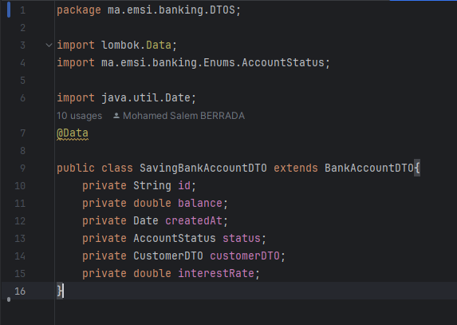
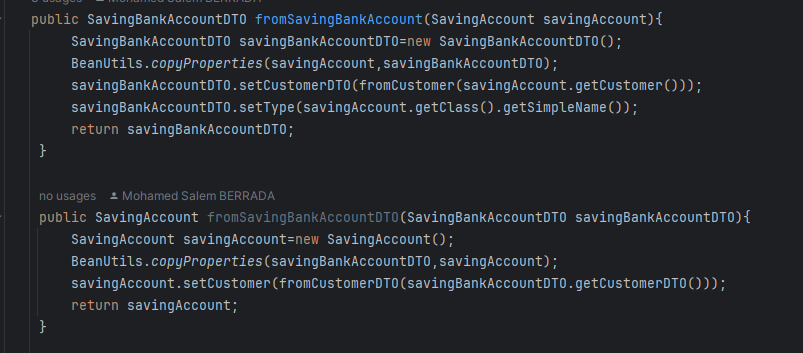

<h3>Compte Rendu Projet Banking </h3>

On considère le schéma suivant : 

<h3>Part 1</h3>
1. <h4>Création des Entités</h4>
    AccountOperation:
    

 
    BankAccount:
    

 
    CurrentAccount:
    

 
    SavingAccount:
    

 
    Customer:
    

 
    
2. <h4>Création des Enumérations</h4>
   AccountStatus: 
    

 
   OperationType: 
    

 

3. <h4>Création des Repositories</h4>
   AccountOperationRepository:
    

 
   BankAccountRepository:
    

 
   CustomerRepository:
    

 
    
4. <h4>Configurer l'unité de persistance dans le ficher application.properties</h4>

 
    Résultat:
   

 
   

 

5. <h4>Ajout des Customers</h4>

 
Résultat :

 

6. <h4>l'Ajout des comptes pour chaque Customer</h4>

 
Résultat:

7. <h4>Ajout des Opérations pour chaque compte</h4>

Resultat :

8. <h4>Mapping et Stratégies</h4>
      Single_Table : 
      

      Resultat :
      

 

      Table_Per_Class :
      

 
      Résultat :
      

      

 

      Joined_Table :
      

 
      Résultat :
      

      

   
   
9. <h4>Migrer de H2 Database vers MySQL</h4>
      application.properties :
      

      

  

<h3>Part 2</h3>
1. <h4>Création des Exceptions</h4>
   BalanceNotSufficientException :
   

 
   BankAccountNotFoundException :
   

 
   CustomerNotFoundException :
   

2. <h4>Création des Services</h4>
   BankAccountService Interface :
   

 
   BankAccountServiceImpl  
   - saveCustomer :
   

 
   - saveCurrentBankAccount :
   

 
   - saveSavingBankAccount :
   

 
   - listCustomers & getBankAccount :
   

 
   - debit :
   

 
   - credit :
   

 
   - transfer & bankAccountList :
   

   
3. <h4>Ajouter des Customers, comptes et des opérations</h4>
   

   Modification BD :
   

   Résultat:
   

   

   

4. <h4>Ajouter Couche Web</h4>
   

   Résultat:
   

   Ajouter Annotation JSON:
   

   Résultat: 
   

   
5. <h4>Ajout des DTOs</h4>
   AccountHistoryDTO :
   

   AccountOperationDTO :
   

   BankAccountDTO :
   

   CreditDTO :
   

   CurrentBankAccountDTO :
   

   CustomerDTO :
   

   DebitDTO :
   

   SavingBankAccountDTO :
   

   TransferRequestDTO :
   

6. <h4>Modification de la couche Service</h4>
   BankAccountService Interface :
   

   

 

   BankAccountServiceImpl 
   - saveCurrentBankAccount :
   

 
   - getAccountHistory :
   

 
   - bankAccountList & getCustomer :
   

 
   - listCustomers & getBankAccount :
   

 
   - saveSavingBankAccount :
   

 
   - saveCustomer :
   

 
   - updateCustomer & deleteCustomer & accountHistory :
   

 

7. <h4> Création des Mappers</h4>
   fromCustomer :
   

 
   fromSavingBankAccount :
   

 
   fromCurrentBankAccount :
   

 
   fromAccountOperation :
   

 

8. <h4>Modification de la couche Web</h4>
   CustomerRestController :
   

 

   BankAccountRestAPI :
   

   

 

9. <h4>Ajout de Swagger UI pour afficher le résultat du backend</h4>
   Ajout de la Dépendance :
   

 

   Afficher le résultat :
   

   

   

   

   
   
